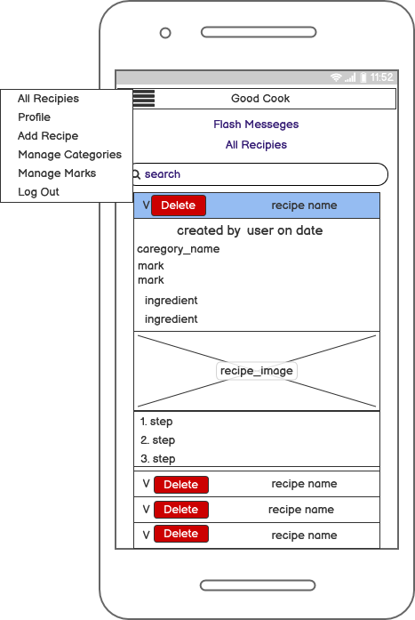
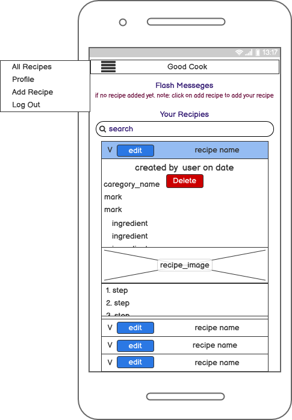
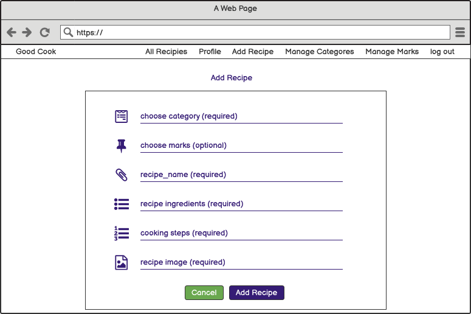
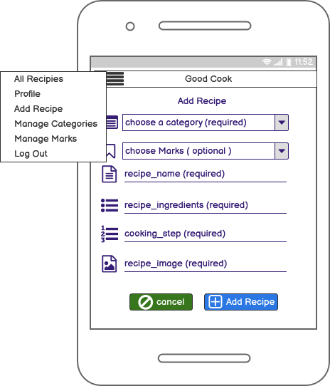
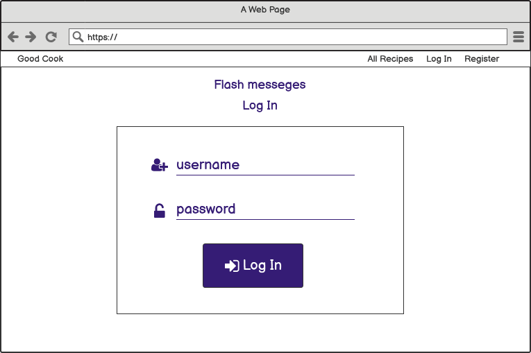
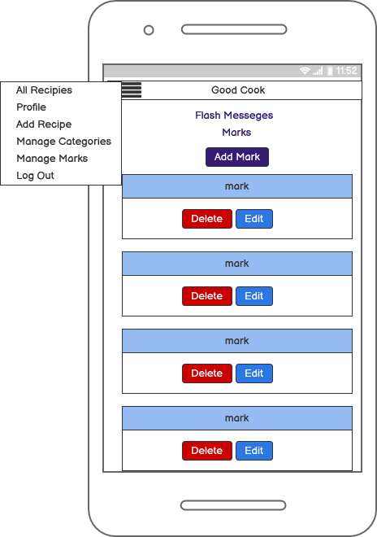
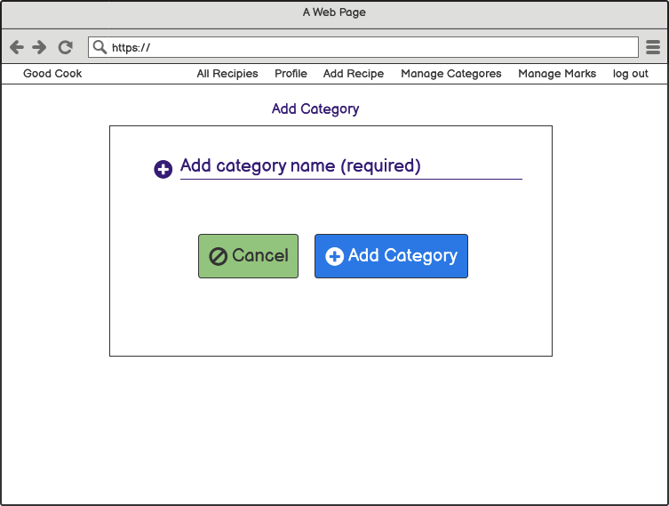
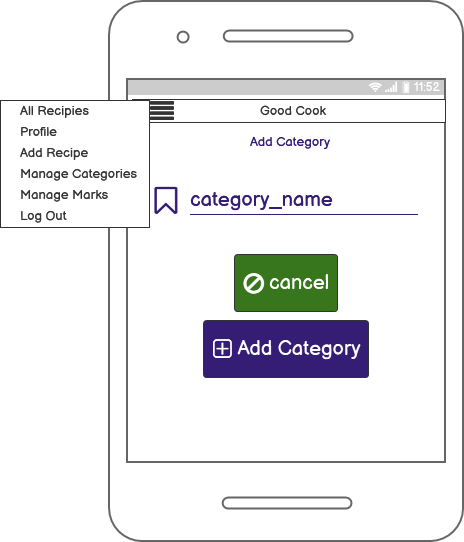
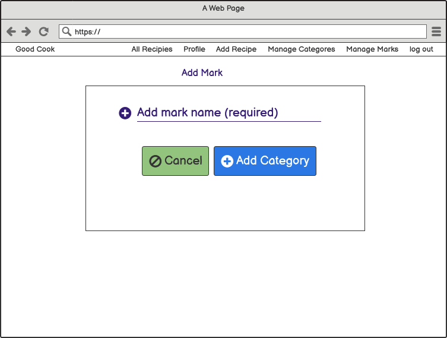
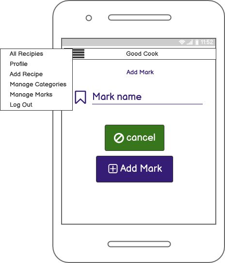

# Good Cook! - Milestone Project 3
A site that allows users to add their own recipes to be viewed publicly!
To view the live version of the site, please click [here](https://good-cook-bk.herokuapp.com/)

## UX Design
### User Stories
*First Time Users*

- As a first time user, I would like to be able to easily navigate to the recipes.
  - I have achieved this by having a button on get_recipes.html that will take the user to the recipes page. There is also a clear description of where the button will take the user.
- As a first time user, I would like to be told how I can add my own recipes.
  - I have achieved this by indicating for not registered users on get_recipes.html page, that the user is able to add recipes to the page by registering a profile, once the user has registered they can add recipes by clicking on add recipe on the top navbar. There is also a note for users that haven't add any recipes yet to their profile page, when they enter their profile, that guides them to add recipe buttton in the top navbar in order to add their own recipes.

*Returning Users*

- As a returning user, I would like to see all of my own recipes seperate from other users.
  - I have achieved this by creating the 'profile.html' page. This page consists of all of the recipes that are created by the session user.
- As a returning User, I want to be able to edit or delete the recipes that are added by myself.
  - I have achived this by providing the edit and delete button on the colapsible header of these recipes in profile page. Delete button change position to the top of collapsible body in mobile view devices
- As a returning User, I don't want my recipes be edited by the Admin.
  - I have achived this by providing only delete button for recipes added by regular users and not gave the option to edit the recipes to the admin user.
*Admin User*

- As an Admin User, I want to be able to delete the unrelated or spams from the recipes.
  - I have achieved this by creating a loop over all delete buttons on all recipes specialized for the admin. Other users can edit or delete only their own recipes.
- As an Admin User, I want to be able to edit or delete the recipes that are added by myself.
- I have achived this by providing the edit and delete button on the collapsible header of these recipes in admin profile page. Delete btn moved to the head on the collapsible body in mobile viewdevices.
- As an admin User, I want to be able to manage the categories and marks for the recipes.
  - I have achived this by making 2 seperated pages for the admin to go through all the categories and marks and add, edit or delete each on on them.
### Wireframes

 #### 
All Recipes

Desktop view | Mobile view
- | -
 Admin | 
 Registered users | 
 Not registered users | 

 #### 
Profile

Desktop view | Mobile view
- | -
 Admin |  
Registered users | 

 #### 
Add Recipes

 Desktop view | Mobile view
- | -
 Admin |  
 Registered users | 

 #### 
Login

 Desktop view | Mobile view
- | -
  All users| 

 #### 
Register

Desktop view | Mobile view
- | -
 All users | 

 #### 
Manage Categories

 Desktop view | Mobile view
- | -
 Admin | 

 #### 
Manage Marks

Desktop view | Mobile view
- | -
 Admin | 

 #### 
Add Category

 Desktop view | Mobile view
- | -
 Admin| 

 #### 
Add Mark

 Desktop view | Mobile view
- | -
 Admin | 

# Features
- All Recipes

  - First collapsible body is open on loading the page to make the page more appealing.
  - Unregistered users and all the other users are able to view all recipes that have been uploaded by registered users on All recipes page.
  - Upon registering/loggin in, the user will be greeted with the flash note on top of the "All Recipes" page(get_recipes.html)
  - All recipes are shown in a collapsible drop down list.
  - The recipe name, created_by, date of the recipe, edit button and delete button is shown on the header of the collapsible list, for desktop view. In mobile views just the recipe name and edit button is shown on the header and the user name and date of insertion and delete button is added on top of the body section of the collapsible. 
  - Recipes information like recipe category, marks, ingredients, cooking steps and recipe image are included in body of the collapsible.
  - Admin Users, will be able to delete the data of recipes entered by all users, whereas everyone else will only be able to edit or delete their own recipes.
  - Delete button is shown in all views to the admin in the colapsible header whereas for other users this button will change position to the top of collapsible body.

- Register/Login

  - On registeration user is asked to enter their first and last name, username and a password and confirmation for the password.
  - A user will need to register a profile to be able to add any recipes, this infomation is on get_recipe.html.
  - If a user tries to register a username which is used by someone else already, they will not be allowed to use that username. The user will be notified of this by use of Flash Messages - "Username already exists!".
  - If a user password and confirm password dosen't match user gets a flash message - "Passwords do not match, please re-enter"
  - tooltips provided on each input field to give more guidence tothe user.
  - When a user has successfully registered their new profile, they will be redirected to 'get_recipes.html'.
  - When a returning user logs in successfully, they will also be redirected to 'get_recipes.html'.
  - If a registered user puts their infomation in incorrectly when loging in, they will be notified by the use of Flash Messages - "Incorrect Username and/or Password".

- log out

  - user is provided by the option to log out when clicking on the button provided on the navbar.
  - By clicking on "Log Out" button user get a message to check if they really want to log out.
  - On log out user redirects to log in page and getting a flash message - "You have been logged out!"

- Profile

  - By clicking on the profile buttton on the top navbar user can see the recipes that have been added by that user and have an option to delete or edit these recipes. This option is also available in All recipes page but only for the recipes that have been created by this user( exept the admin that can delete any recipe)
  - Once the user has added the required information for the recipe, they will see it on their profile page with a flash message of top on the page indicating that the recipe added.

- Add Recipe

  - The 'Add Recipe' button will redirect the users to the form template that the users will need to fill out to add their recipes. 
  - When users are adding a new recipe, they are guided through with notifications of what to do and requirements. 
  - The form will not be able to be submitted with any required boxes not filled out by the user.

- Edit form

  - If users ever decide that they would like to edit any of the data, all they need to do is click on the edit button on the head part of the collapsible on either "All Recipe" page or "Profile" page. For admin, this button can be found only on profile page for his/her own recipes.
  By clicking on edit button, edit form will reveal with all the previous information that have been added to the form.
  - User can change any part they desire and then click on edit button at the bottom of the page.
  - If user decided to not change the informations they can click on the cancel buttton next to edit buttton.

- Delete buttton

  - If users ever decide that they would like to delete any of the data, all they need to do is click on the delete button on the head part of the collapsible on either "All Recipe" page or "Profile" page.
  - In mobile view devices the delete buttton is located on top of the recipe body instead.( exept for the admin)
  - When the user tries to delete a recipe, they will be asked to confirm if that is what they really want to do by means of a confirmation message. This is to prevent any user to delete a recipe by mistake. 

- Add category and marks
  - Admin can add, edit or delete the categories or marks by clicking on these options provided for them in two buttons provided only for admin in the navbar.

# Features Left to Impliment

 - Adding a like/dislike button for each Recipe and sort the recipes from the most to least favorites.
 - Adding the liked recipes in a new section in profile page.
 - Adding a footer with social media sites for the app.
 - Seperating the recipes in different sections for each category.
 - Give more accessibility to the admin if needed.
 - More secure pathway for the admin.
--- 
# Technologies Used 
- [HTML5](https://en.wikipedia.org/wiki/HTML)
  - To give the page its structure and presenting static data.
  - All HTML files are located within the 'templates' directory.
- [CSS](https://en.wikipedia.org/wiki/CSS)
  - CSS has been used to style and customise the content of this project.
- [Materialize](https://materializecss.com/)
  - This is a framework that I have used to simplify CSS classes, features that have been used and modified include the navbar, responsive design classes, and colors for backgrounds and text.
  
- [JQuery](https://en.wikipedia.org/wiki/JQuery)
  - JQuery has been used to give the site its functionality as well as making DOM manipulation simpler.
  - Pages that include functionality are:
    - get_categories, get_marks, add_categories and add_marks for Admin users only
    - get_recipes.html, register.html and login.html for all users
    - profile.html, add_recipe and edit_recipe for registered users only
- [MongoDB](https://en.wikipedia.org/wiki/MongoDB) 
  - As the data entered by users can always be different from one to the next, the project uses MongoDB to store its data as MongoDB is a Document Based Database.
- [Flask](https://en.wikipedia.org/wiki/Flask_(web_framework))
  - Flask is a framework that allows developers to easily present data in an orderly fashion. All data entered by a user, such as the Recipe Name, is presented to users with a few lines of code embedded into the HTML.
  - Modules from Flask that have been included are:
    - Flask
    - flash
    - render_template
    - redirect
    - request
    - session
    - url_for
    - PyMongo
- [bson.objectid](https://www.npmjs.com/package/bson-objectid)
    - ObjectId
- [werkzeug.security](https://werkzeug.palletsprojects.com/en/1.0.x/utils/)
    - generate_password_hash
    - check_password_hash
- [datetime](https://docs.python.org/3/library/datetime.html)
    - datetime
- [Python](https://www.python.org/)
  - Python is working very closely with Flask to manipulate data and HTML across multiple pages within the app.
- [Heroku](https://en.wikipedia.org/wiki/Heroku)
  - Heroku has been used to deploy and host the app as it meets the need of being able to handle python.
- [Google Fonts](https://fonts.googleapis.com/css2?family=Montserrat:ital@1&family=Yusei+Magic&display=swap" rel="stylesheet)
  - The font I have used for the body of this project is called Montserrat and for the headers, input and labels I used Yusei Magic font with sans-serif as a backup font.
--- 
# Testing 
## Register.html
- Test 1 - Register - Test Passed ✓ 
  - Step 1 - Click the register button on the navbar for desktop view devices or side navbar for tablet or mobile view devices.
  - Step 2 - Put in a first name(2 character minimum).
  - Step 3 - Put in a last name (also 2 character minimum).
  - Step 4 - Put in a username which is unique (5 character minimum).
  - Step 5 - Put in a password (also 5 character minimum).
  - Step 6 - Click 'Register' button.
  - Step 7 - Be redirected to 'get_recipes.html' with a flash message, welcoming the user.
- Test 2 - Register with a username which already exists - Test Passed ✓ 
  - Step 1 - While on 'register.html', enter username 'admin' or any username existing in our data base.
  - Step 2 - Enter password (5 character minimum).
  - Step 3 - Click the 'Register' button.
  - Step 4 - Be presented by flash message containing "Username already exists!".
- Test 3 - Register with less than 2 Alphabet for first and last name and less than 5 characters for username - Test Passed ✓
  - step 1 - While on 'register.html', enter first or last name with numbers or less than 2 alphabet is shown invalid.
  - Step 2 - While on 'register.html', enter username or password with less than 5 charecters is shown invalid.
  - Step 3 - As the 'Required' and minlength=2 for first and last name, and minlength=5 for username and password has been added, the form will not be submitted.
  - Step 4 - Changing first and last name to more than 1 alphabet, and username and password to more than 4 charecters will submit the form.
  - step 5 - All the tooltips are shown an the page by hovering over the input icon.
## Login.html
- Test 1 - Log In - Test Passed ✓
  - Step 1 - Enter your Username.
  - Step 2 - Enter your Password.
  - Step 3 - Click the 'log in' buttton.
  - Step 4 - Be redirected to 'get_recipes.html' with flash message containing "Welcome, [ user ]".
- Test 2 - Log in attempt with incorrect info - Test Passed ✓
  - Step 1 - Enter credentials that are incorrect.  
  - Step 2 - Click the 'log in' button.
  - Step 3 - Be redirected to the log in page with a flash message containing "Incorrect Username and/or Password".
## Adding a New Recipe 
- Test 1 - Adding a New Recipe - Test Passed ✓
  - Step 1 - Log In.
  - Step 2 - Be redirected to get_recipes.
  - Step 3 - Click the button labeled 'Add Recipe'.
  - Step 4 - Be redirected to the form for user to fill in.
  - Step 5 - Form is tried to be submitted with empty fields for required fields and faild; user is notified of missing items.
  - Step 6 - There is 1 multichoice dropdown field on the form, which is called marks. This field is not required and the form still successfully post if this field is empty.
  - Step 7 - There is a cancel button provided on the bottom of the form. If the user don't want to add the recipe. he/she can click on this button and get redirected to their profile page.
  - Step 8 - Once the form is filled out to the satsfaction of the constraints and the 'Add Recipe!' button is clicked user will be redirected to 'profile.html' where the user can see their newly added recipe located alphabeticly in the colapsible dropdown list with the first input field open to make the page more appealing. User also be notified that the new recipe added by flash notifications.
  - Step 7 - Check the contents of the newly added recipe right away by clicking on that recipe in the dropdown list.
- Test 2 - Avoids empty strings in out textarea fields - Test Passed ✓
  - If empty lines are added to the ingredients or cooking steps text areas it would be removed when showing the recipe in the all recipes or profile page.
## Editing/Deleting a Recipe 
- Test 1 - Editing a Recipe - Test Passed ✓
  - Step 1 - Navigate to profile or All recdipe page.
  - Step 2 - Click the button labeled "EDIT" for the desired recipe.
  - Step 3 - Navitgate to the part of the recipe that the user wishes to edit.
  - Step 4 - After editing the desired part, click on the blue button, "EDIT RECIPE" at the bottom of the page to edit the recipe.
  - Step 5 - Be redirected to profile.html and a flash message notifing the user that the recipe is updated.
  - Step 6 - Should the user wish to cancel the action, they can click on the cancel button located on bottom left.
    - Step 7 - If user clicks the cancel button he/she will be redirected to profile page and all changes will be disregarded. 
- Test 2 - Deleting a Recipe - Test Passed ✓
  - Step 1 - Navigate to All Recipes, or profile page.
  - Step 2 - Click the button labeled "DELETE". In mobile phone view this button can be found on top of the recipe collapsible body.
  - Step 3 - User gets a message if they are sure to delete this recipe.
  - step 4 - If confirm the recipe deletes and user redirects to their profile page but if press cancel, recipe stayes unchanged and the user will be redirected to their profile page.
- Test 3 - Avoid duplication in multi choice dropdown input field - Test Passed ✓
  - step 1 - In edit form in marks field user can just add one of each choices.
## Admin Capability
- Test 1 - Delete any Recipe - Test Passed ✓
  - Step 1 - Navigate to get_recipes.
  - Step 2 - User navigates to the recipe which he/she would like to delete.
  - Step 3 - User clicks the red delete button.
  - step 4 - User should confirm if he/she really wishes to delete this recipe.
  - step 5 - If press "Ok" recipe deletes and user redirects to All recipes page.
  - Step 7 - If press "cancel" recipe stayes untouched.
- Test 3 - Add, edit or delete categories or marks - Test Passed ✓
  - step 1 - Click on the Manage Categries to manage the categories or Manage Marks to manage the marks.
  - step 2 - Admin can sees all the categories in manage categories and all the marks in manage marks in a seperate card with an option of delete or edit and an Add button on top of the page to add a new category or mark.
  - step 3 - By clicking on the add button, a one input field form, called add category or add mark opens regardingly.
  - step 4 - Admin can write the desired name for the new category/mark and press the Add category or Add mark at the bottom of the form.
  - step 5 - Admin is provided also with a cancel button in both pages if he/she decided to not add any new category or mark.
  - step 6 - Pressing this key bring up a note if he/she is sure not to add any category or mark.
  - step 7 - if press ok, admin redirects to the get_categories if in add category form, or get_marks if in add marks form.
---
## Validators
The validators that have been used on the project are as followed:

  - [HTML Validator](https://validator.w3.org/nu/) - No issues apart from jinja templating
  - [CSS Validator](https://jigsaw.w3.org/css-validator/) - No issues
  - [JavaScript Validator](https://jshint.com/) - No issues 
  - [Python Validator](http://pep8online.com/) - No issues
---
# Deployment 
For the project to successfully deploy, the following are requirements are needed:
- Python
- Github account or similar IDE 
- MongoDB
- Heroku 
### **Cloning the Project**
  - Step 1 - log in to your github account and go to the repository.
  - Step 2 - Click on 'Code'.
  - Step 3 - Click the link to copy
  - step 4 - Within the gitpod/IDE type 'GIT CLONE' into the terminal followed by the link and press enter.
### **Heroku Deployment**
  - Step 1 - Within the terminal, type 'pip freeze > requirements.txt' - this command will generate a .txt file with all of the requirements necessary for Heroku to run the app.
  - Step 2 - Within the terminal, type 'echo web: python app.py > Procfile' - This tells Heroku that this is a web based app.
  - Step 3 - Assuming you have an account, log in to Heroku and set up a new app with the region that is closest to you.
  - Step 4 - You will need to set up your own config vars both on Heroku and within env.py for the app to access the data properly, these will include:
    - IP 
    - PORT 
    - SECRET_KEY
    - MONGO_URI
    - MONGO_DBNAME
  - Step 5 - Select deploy method of choice. I have set up Automatic Deployments by connecting to my github account and enabled automatic deployments from the master branch
  ---
# Credits 
### Recipes
All recipes currently on the page have all been added from google by Behnaz Khoshnood.
### Recipe Images 
All images used on the page are linked below:
- Adas polo
  - https://www.saveur.com/resizer/Wnizk_4UQkqFMI5XmMydgOXf4J8=/1200x628/smart/arc-anglerfish-arc2-prod-bonnier.s3.amazonaws.com/public/L2N233EB3VWQE43J7IJHYBS3Z4.jpg
- Chicken enchilada dip
  - https://www.familyfreshmeals.com/wp-content/uploads/2014/06/Cheesy-Chicken-Enchilada-Dip-BEAUTY_1-768x512.jpg
- Chicken nuggets
  - https://www.gimmesomeoven.com/wp-content/uploads/2014/08/Baked-Parmesan-Chicken-Nuggets-31-260x195.jpg
- Chicken tikka masala
  - https://hips.hearstapps.com/hmg-prod.s3.amazonaws.com/images/delish-chicken-tikka-masala-jpg-1526059261.jpg
- 
### Materialize
For this project, I have used and modified content from the Materialize Docs. Aspects include:
  - Navbar 
  - Color classes 
  - JQuery Initialization
  - Card
### Font Awesome 
- Icons used on this site have been taken from [font awesome](https://fontawesome.com/).
### Google Fonts 
- The font family used on this site is called Abel and can be seen [here](https://fonts.google.com/?query=abel)

#### This project is purely educational, please contact me if there are any issues with Copyright.
behnaz.khoshnood@gmail.com